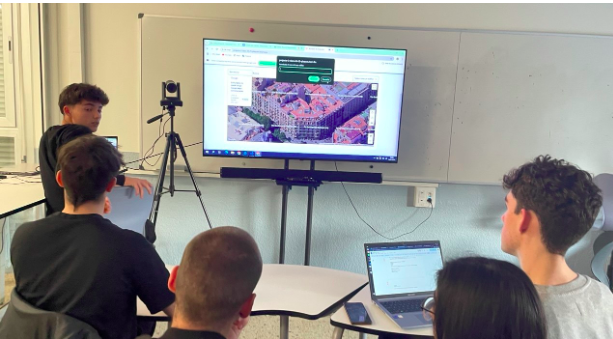
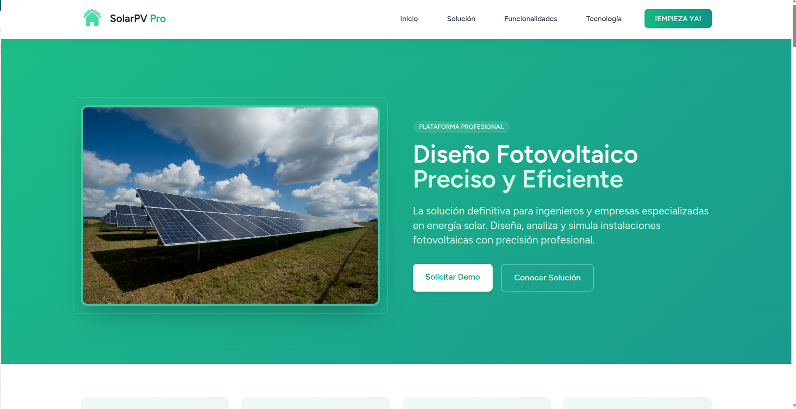
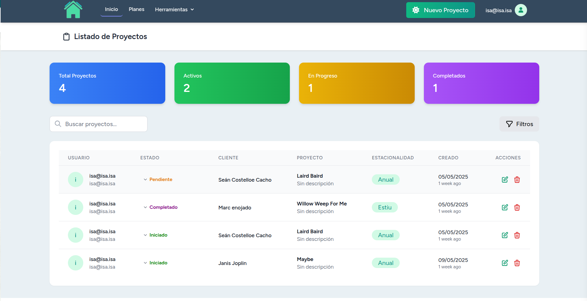
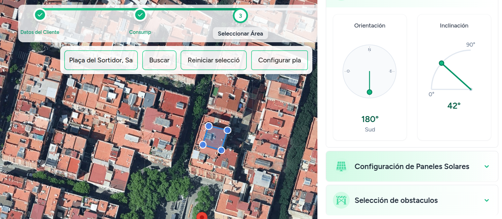
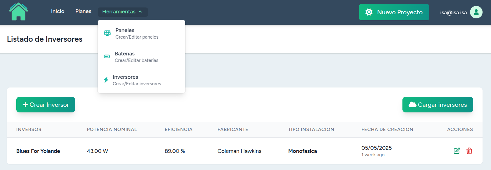

<p align="center">
  
</p>
<p align="center">
	 Fotovoltaica fàcil!
 </p>


# 👥 Fotovoltaica

|| Nom | User |
|--|--|--|
|[](https://github.com/marcSantolayaSanchez) | Marc Santolaya Sànchez |[@marcSantolayaSanchez](https://github.com/marcSantolayaSanchez)||
[]() | Teo Castellví Montañés |[@TeoCastellvi](https://github.com/TeoCastellvi)||
|[](https://github.com/SeanITB)| Seán Costelloe Cacho |[@SeanITB](https://github.com/SeanITB)|

# 📂 Estructura del repositiori
En el següent diagrama, mostrem quines són les carpetes que hem utilitzat, la resta són directoris de configuració o que ja venien per defecte.
```sh
├── app
│   ├── Http
│   │   ├── Controllers # La lógica del Back-end.
│   ├── Imports # Classes per fer les importacions dels diferents objectes.
│   ├── Models # Tots els models de tots els objectes, són com la definició.
├── database
│   └── migrations # La definició de totes les migration, són les estructures de les taules que aniran a la BD.
├── public
│   ├── build
│   │   ├── api # Logica de l'api
│   │   ├── css # Els fulls d'estils
│   │   └── js # Tota la llogica del Front-end
├── resources
│   ├── css # Els fulls d'estils
│   ├── js # Tota la llogica del Front-end
│   └── views # Totes les vistes del Front-end
└── routes
```

# De què va l'aplicació

L'objectiu de la nostra aplicació web, és oferir una solucio definitiva per ingeniers i empresas especialitzades, per disenyar, alalitzar i simular instalacions fotovoltaiques amb la maxima presició.



La pàgina d'inici amb totes les opcions del projecta bisibles i els projectes llistats.



Els diferents formularis del projecte, amb el mapa per poder selectionar un pentagon on es selecionararn les plaques.



Les vistes d'eines on es poden crear plaques, bateries i inversors.



